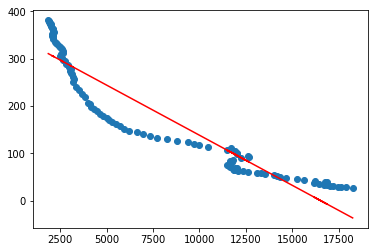

```python
import numpy as np
import pandas as pd
import os
from os import listdir
import matplotlib.pyplot as plt
import plotly.express as px
import plotly.graph_objs as go
from sklearn.linear_model import LinearRegression
from math import log,sqrt
from sklearn.preprocessing import FunctionTransformer
```
#PROBLEM 1 AND 2

# I reviewed https://github.com/karangm-dev/ds5500-hw1/blob/master/src/app.ipynb for problem - 2
# I think the meaning is accuractely captured by the descrription in the solution and the graphs help me understnad
# the change in GDP across countries and continents by using both the plots


# I aslo reviewed https://github.com/rathiromil13/Info_Viz_HW1
# the interactive plot with time helps me understand the change in GPD across constinents and second plot for each 
# of the continent gives a clearer picture among countries in a continent. and does capture what the question asked # for.

```python
income_gdp_percapita = "/home/quazar07/Desktop/InfoViz/ddf--gapminder--systema_globalis-master/ddf--datapoints--income_per_person_gdppercapita_ppp_inflation_adjusted--by--geo--time.csv"
life_expectancy = "/home/quazar07/Desktop/InfoViz/ddf--gapminder--systema_globalis-master/ddf--datapoints--life_expectancy_years--by--geo--time.csv"
child_mortality = "/home/quazar07/Desktop/InfoViz/ddf--gapminder--systema_globalis-master/ddf--datapoints--child_mortality_0_5_year_olds_dying_per_1000_born--by--geo--time.csv"
```


```python
income_data = pd.read_csv(income_gdp_percapita)
life_expectancy_data = pd.read_csv(life_expectancy)
child_mortality_data = pd.read_csv(child_mortality)
```


```python
grouped_income_data = income_data.groupby(['time'])['income_per_person_gdppercapita_ppp_inflation_adjusted'].mean().to_frame().reset_index(level=['time'])
grouped_life_expectancy_data = life_expectancy_data.groupby(['time'])['life_expectancy_years'].mean().to_frame().reset_index(level=['time'])
grouped_child_mortality_data = child_mortality_data.groupby(['time'])['child_mortality_0_5_year_olds_dying_per_1000_born'].mean().to_frame().reset_index(level=['time'])
```


```python
filtered_income_data = grouped_income_data[(grouped_income_data['time']>1900) & (grouped_income_data['time']<2019)]
filtered_life_expectancy_data = grouped_life_expectancy_data[(grouped_life_expectancy_data['time']>1900)&(grouped_life_expectancy_data['time']<2019)]
filtered_child_mortality_data = grouped_child_mortality_data[(grouped_child_mortality_data['time']>1900)&(grouped_child_mortality_data['time']<2019)]
```


```python
# PROBLEM 3

X = filtered_income_data.iloc[:,1].values.reshape(-1,1)
Y = filtered_life_expectancy_data.iloc[:,1].values.reshape(-1,1)
```


```python
#Trying a linear model, with linear regression

linear_regressor = LinearRegression()  
linear_regressor.fit(X, Y)  
Y_pred = linear_regressor.predict(X)
plt.scatter(X, Y)
plt.plot(X, Y_pred, color='red')
plt.show()
```


```python
#Trying a logarithmic transformed model, with linear regression
linear_regressor = LinearRegression()
transformer = FunctionTransformer(np.log1p, validate=True)
linear_regressor.fit(transformer.transform(X), Y)  
Y_pred = linear_regressor.predict(transformer.transform(X))
plt.scatter(X, Y)
plt.plot(X, Y_pred, color='red')
plt.show()
```


The logarithmic fit the distribution really well. this is also not very surprising as the expectancy would depend a lot on the GDP, as this increases the standard of living and  availability of better medical resources, but the increase slows down as GDP increases this might be because after an age medical resources might not help much in furthering expectancy. The logarithmic function also explains that although slow the expectancy increase ever so little with the increase in GDP.

```python


X = filtered_income_data.iloc[:,1].values.reshape(-1,1)
Y = filtered_child_mortality_data.iloc[:,1].values.reshape(-1,1)
```


```python

#Trying a linear model, with linear regression

linear_regressor = LinearRegression()  
linear_regressor.fit(X, Y)  
Y_pred = linear_regressor.predict(X)
plt.scatter(X, Y)
plt.plot(X, Y_pred, color='red')
plt.show()
```





```python
#Trying a logarithmic transformed model, with linear regression
linear_regressor = LinearRegression()
transformer = FunctionTransformer(np.log1p, validate=True)
linear_regressor.fit(transformer.transform(X), Y)  
Y_pred = linear_regressor.predict(transformer.transform(X))
plt.scatter(X, Y)
plt.plot(X, Y_pred, color='red')
plt.show()
```


```python
#Trying a quadratic transformed model, with linear regression
linear_regressor = LinearRegression()
transformer = FunctionTransformer(np.sqrt, validate=True)
linear_regressor.fit(transformer.transform(X), Y)  
Y_pred = linear_regressor.predict(transformer.transform(X))
plt.scatter(X, Y)
plt.plot(X, Y_pred, color='red')
plt.show()
```


The logarithmic fit seemed to explain the mortality rate well with change in  GDP. It makes logical sense that the mortality rate goes down as the as financial freedom increases. The logarithmic part of the fit explains as you move from middle class to rich and from there to very rich child mortality still decreases. This surprised me because after reaching a point of financial status the extra riches will not get any better medical treatment on an average, on the contrary it actually helps this might be because some more attributes contribute to lesser child mortality than just medical treatment but that just might be speculation.